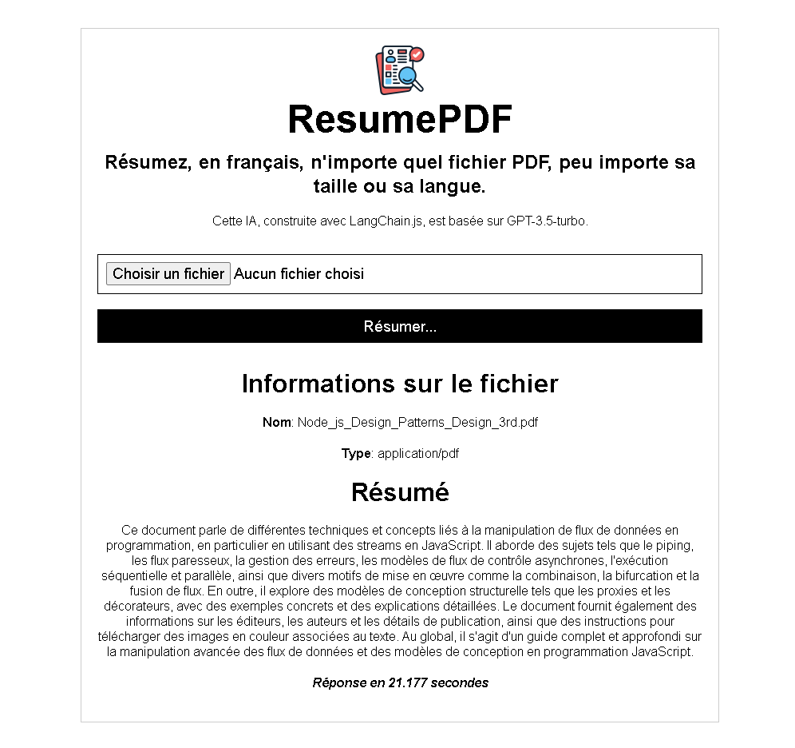

# ResumePDF

Summarize, in French, any PDF file, regardless of its size or language. This AI, built with LangChain.js, is based on GPT-3.5-turbo.

This app implements a typical RAG Achitecture: Indexing + Retrieval and generation.

To improve this app you have to focus on the prompt using prompt engineering techniques.

### This project was created with:

  &nbsp;
  &nbsp;
  &nbsp;
  &nbsp;

